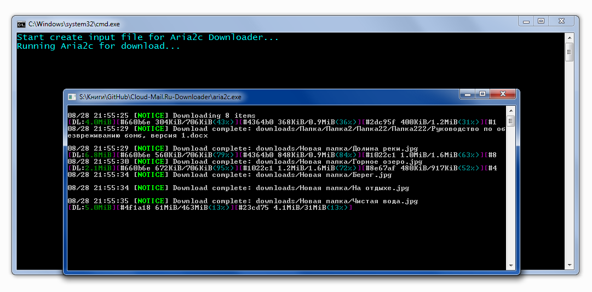

# Fork of [Cloud&#64;Mail.Ru Downloader](https://github.com/Geograph-us/Cloud-Mail.Ru-Downloader)

## EN
### Creds
All creds go to [author](https://github.com/Geograph-us) of original script, I just changed them to my needs

---
### Changes
- Исправлена проблема [Page ID not found](https://github.com/Geograph-us/Cloud-Mail.Ru-Downloader/issues/18), которая по неизвестным причинам не вмёржена в мастер в оригинальном репозитории
Многопоточное скачивание из облака [Mail.Ru](http://cloud.mail.ru/) по публичной ссылки. Авторизация в Mail.Ru не требуется.
- Убрано всё привязанное к Windows, и написан скрипт запуска в unix-like системах

### About
- Скрипт консольный, написан на PHP.
- Для скачивания используется консольный загрузчик [Aria2c](https://aria2.github.io/).
- Скрипт умеет корректно обрабатывать папки в облаке любой вложенности.
- Поддерживается докачка файлов.

### How to run

- В файл `links.txt` записать публичные ссылки на скачивание с облака вида https://cloud.mail.ru/public/9bFs/gVzxjU5uC по одной на строку.
- Запустить `run.sh`
- Скрипт сформирует файл с прямыми ссылками на скачивание `input.txt`.
- После чего запустится Aria2c Downloader, который скачает файлы из `input.txt`.
- Остаётся наблюдать за закачкой и ждать её завершения. Скачанные файлы окажутся в папке `downloads`.

---

## RU
### Creds
Всё авторство пренадлежит [создателю](https://github.com/Geograph-us) оригинального скрипта, я лишь поменял под свои нужды
---
### Изменения
- Исправлена проблема [Page ID not found](https://github.com/Geograph-us/Cloud-Mail.Ru-Downloader/issues/18), которая по неизвестным причинам не вмёржена в мастер в оригинальном репозитории
Многопоточное скачивание из облака [Mail.Ru](http://cloud.mail.ru/) по публичной ссылки. Авторизация в Mail.Ru не требуется.
- Убрано всё привязанное к Windows, и написан скрипт запуска в unix-like системах

### О скрипте
- Скрипт консольный, написан на PHP.
- Для скачивания используется консольный загрузчик [Aria2c](https://aria2.github.io/).
- Скрипт умеет корректно обрабатывать папки в облаке любой вложенности.
- Поддерживается докачка файлов.

### Порядок работы

- В файл `links.txt` записать публичные ссылки на скачивание с облака вида https://cloud.mail.ru/public/9bFs/gVzxjU5uC по одной на строку.
- Запустить `run.sh`
- Скрипт сформирует файл с прямыми ссылками на скачивание `input.txt`.
- После чего запустится Aria2c Downloader, который скачает файлы из `input.txt`.
- Остаётся наблюдать за закачкой и ждать её завершения. Скачанные файлы окажутся в папке `downloads`.

